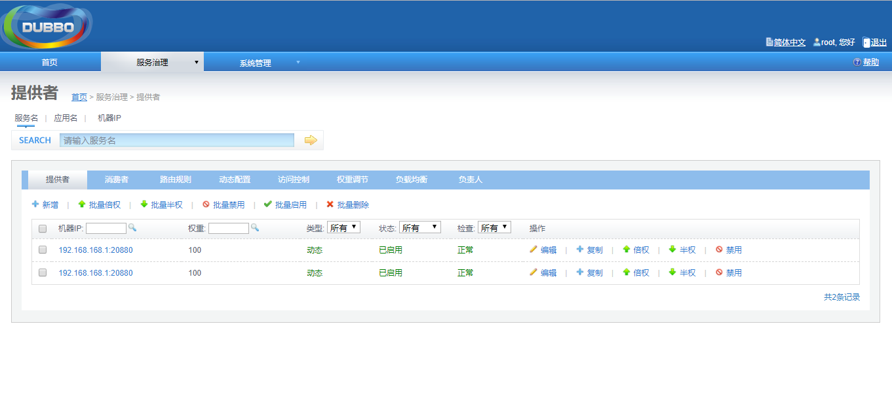
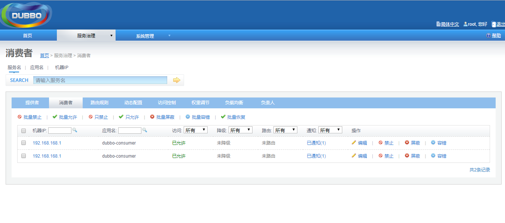
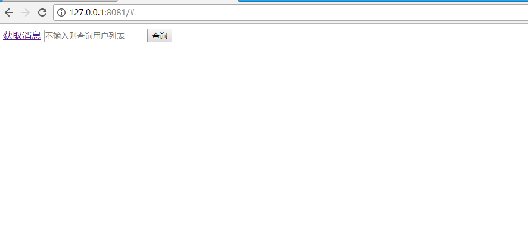
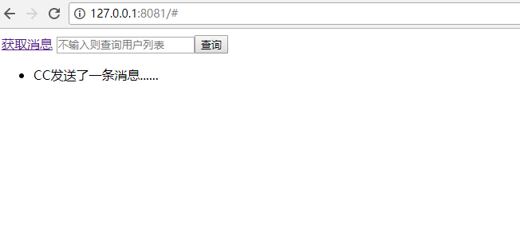
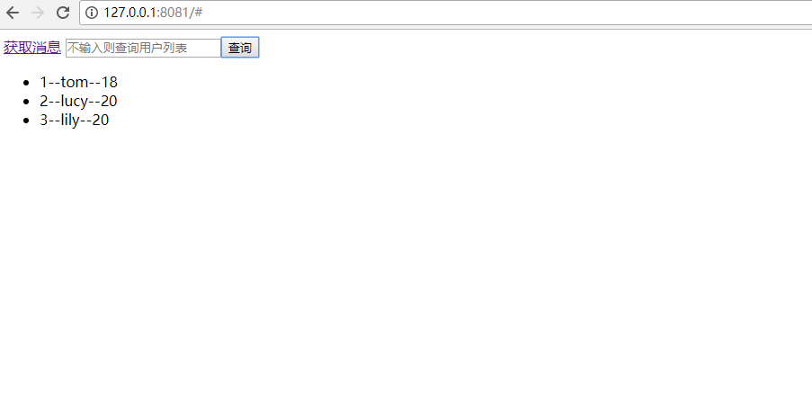
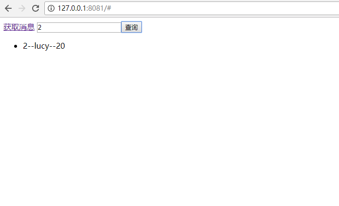

#### 2018/10/30 更新内容
- 在源代码基础上新建分支1.1
- 修改pom依赖问题

## springboot-dubbo分布式项目

## 一、介绍
- 本项目是一个maven构建的基于zookeeper和dubbo的多模块分布式项目模板，同时实现了分布式锁功能，可以在此基础上使用这个模板进行项目创建和改造。

## 二、采用技术
- SpringBoot；
- MyBatis；
- Redis；
- Druid；
- Zookeeper；
- Dubbo；
- Freemarker。

## 三、部署方式
- 通过git下载源码；
- 创建数据库springboot_dubbo，数据库编码为UTF-8；
- 导入doc/springboot_dubbo.sql文件，默认文件中已包含初始化数据；
- 修改application.yml文件，更新MySQL账号和密码；
- 开启zookeeper；
- 开启dubbo（非必须）；
- 修改dubbo-provider、dubbo-consumer模块的application.yml中zookeeper配置信息；
- maven编译；
- 开启DubboProviderApplication.java；
- 开启DubboConsumerApplication.java。

## 测试
- 基础测试：访问：http://127.0.0.1:8081
- 分布式锁测试：对于userServiceImpl实现了基于redis的分布式锁功能，具体代码可以去查看。

## 预览图

